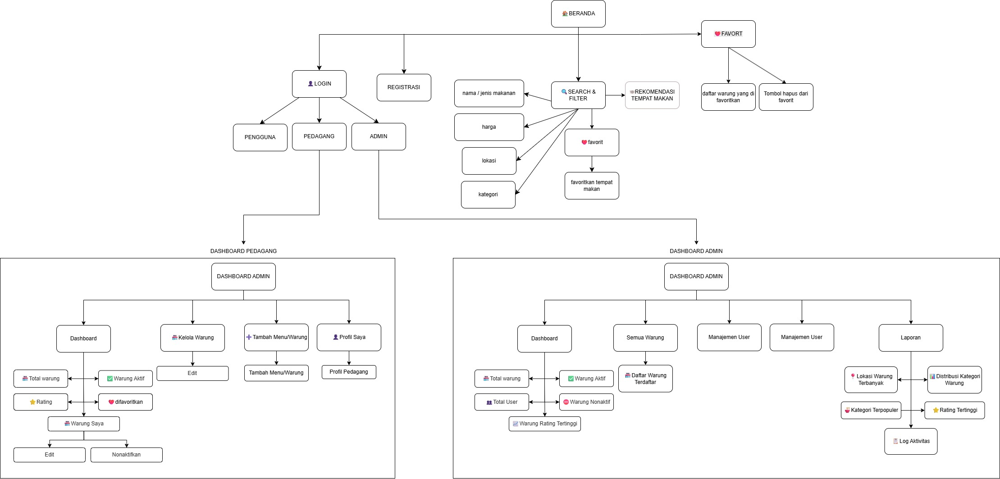

## TEAM CariMakan :
1. Muhammad Mikroju Raseprian Sahid (F1D02410017)
2. Azkal Arya Habibie (F1D02410038)
3. Fatriya Annastha Putra (F1D02410046)

## Deskripsi CariMakan
CariMakan adalah website kuliner interaktif yang membantu pengguna menemukan tempat makan terbaik dengan mudah, cepat, dan praktis. Website ini menyediakan informasi lengkap mengenai restoran, cafe, street food, hingga UMKM kuliner lokal dengan fitur pencarian, kategori makanan, lokasi interaktif, review pengguna, dan rekomendasi makanan populer.

Pengguna dapat melihat detail tempat makan seperti menu, harga, rating, jam operasional, lokasi pada peta, hingga ulasan dari pengguna lain. Selain itu, platform ini juga mendukung peran berbeda seperti User, Pedagang, Reviewer, dan Admin untuk menciptakan ekosistem kuliner digital yang terintegrasi.

## ✨ Fitur Utama

### 👤 Untuk Pengguna Biasa
- Dashboard khusus pengguna
- Jelajah tempat makan dengan filter dan pencarian
- Detail tempat makan lengkap
- Peta lokasi interaktif
- Simpan tempat makan favorit
- Sistem review dan rating
- Profil pengguna dan riwayat review
- Dashboard rekomendasi kuliner populer

### 🧑‍🍳 Untuk Pedagang
- Dashboard khusus pedagang
- Kelola profil usaha kuliner
- Tambah dan edit menu makanan
- Upload foto makanan dan tempat usaha
- Kelola jam operasional
- Melihat review pelanggan

### 🛡 Untuk Admin
- Dashboard khusus admin
- Kelola user dan pedagang
- Verifikasi akun pedagang
- Monitoring review dan aktivitas platform
- Kelola kategori makanan
- Moderasi konten pengguna

## 👥 Tim Pengembang
------------------------------------------
| Nama    | Tanggung Jawab               |
|---------|------------------------------|
| Mikroju | Handle bagian pedagang       |
| Fatriya | Handle bagian pengguna biasa |
| Azkal   | handle bagian admin          |
------------------------------------------

## 🛠️ TECH STACK
## Frontend
- HTML5
- CSS3
- JavaScript
## Backend
- PHP Native
## Database
- MySQL
## Development Tools
- Visual Studio Code
- XAMPP
- GitHub

## Site Map

## DBMS Configuration
## DBMS Used : 
MySQL
## Database Name :
carimakan
## Default Port :
3306
## Database Connection Example :
-
## Table Specifications
1. Users
2. Pedagang
3. Admin
4. Warung
5. Favorit

## 🔮Future Development
-
